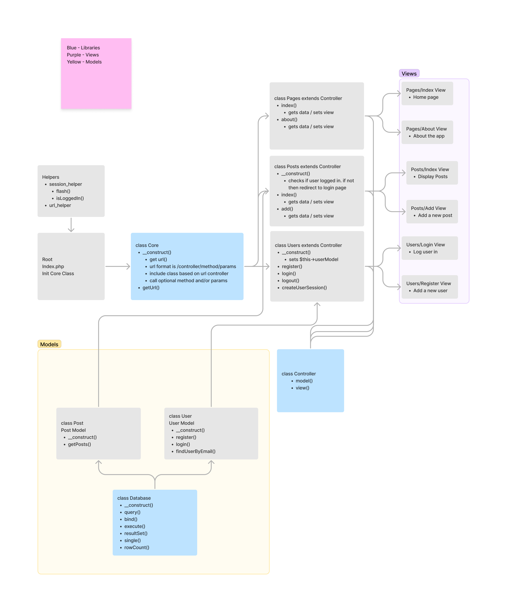

# PHP Model View Controller Framework + App
Here is my PHP Model-View-Controller App. This is based off the course 'Object Oriented PHP & MVC' by Brad Traversy on Udemy

## App Flowchart

## App Structure

Root

/app/

/app/config/config.php -> App constant variables (ignored by git)

/app/controllers -> All app controllers 

/app/controllers/Pages.php -> Pages controller

/app/helpers/ -> Nothing yet

/app/libraries/ -> App libraries

/app/libraries/Controller -> Main controller class. Extended by all classes in /app/controllers

/app/libraries/Core.php -> Core app logic. Gets Url and requires assosicated controller/method/params

/app/libraries/Database.php -> Db related class/methods

/app/models/ -> Nothing yet

/app/views/ -> App views

/app/views/includes/ -> header.php/footer.php. PHP files that will be in all views

/app/pages/ -> App pages

/public/ -> Static assets such as css, images, and js. 

/public/index.php -> initialize app

