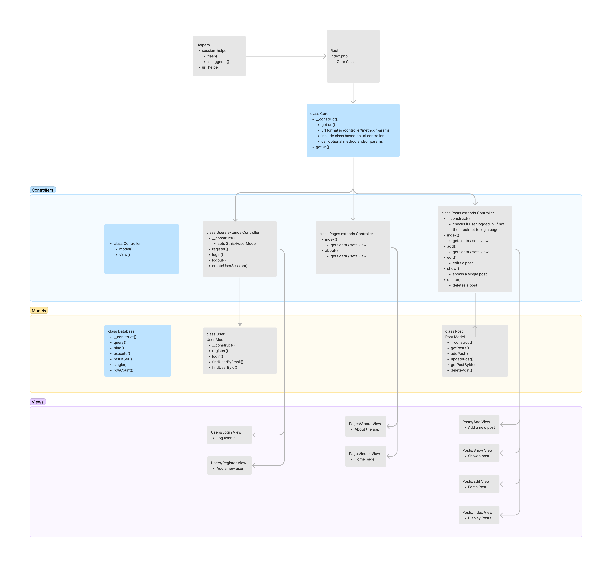

# PHP Model View Controller Framework + App
Here is my PHP Model-View-Controller App. This is based off the course 'Object Oriented PHP & MVC' by Brad Traversy on Udemy. This app is a basic multi-user CRUD app.

## App Flowchart

